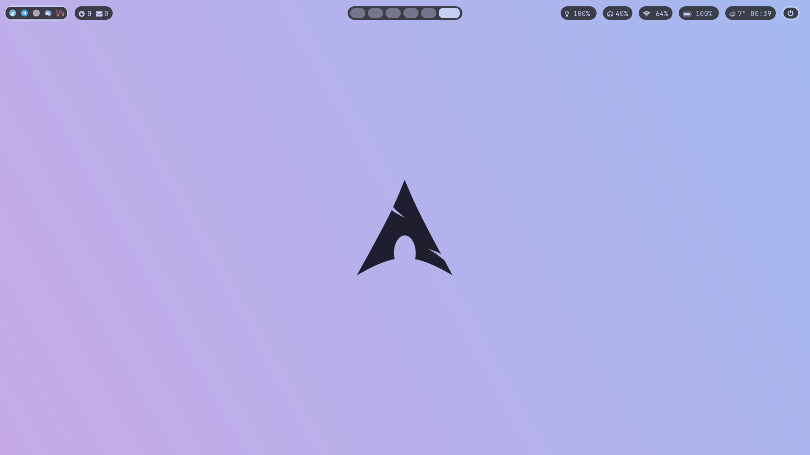
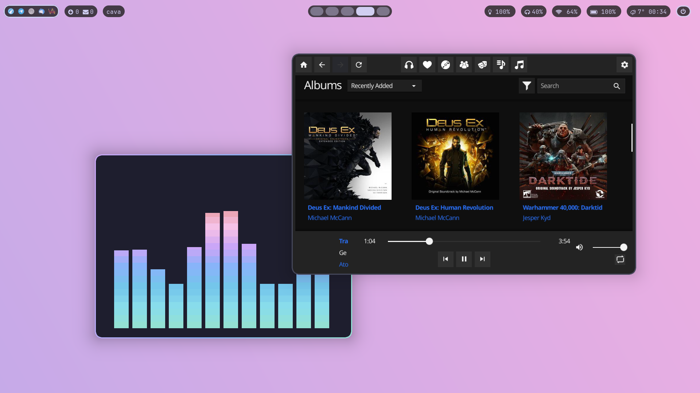
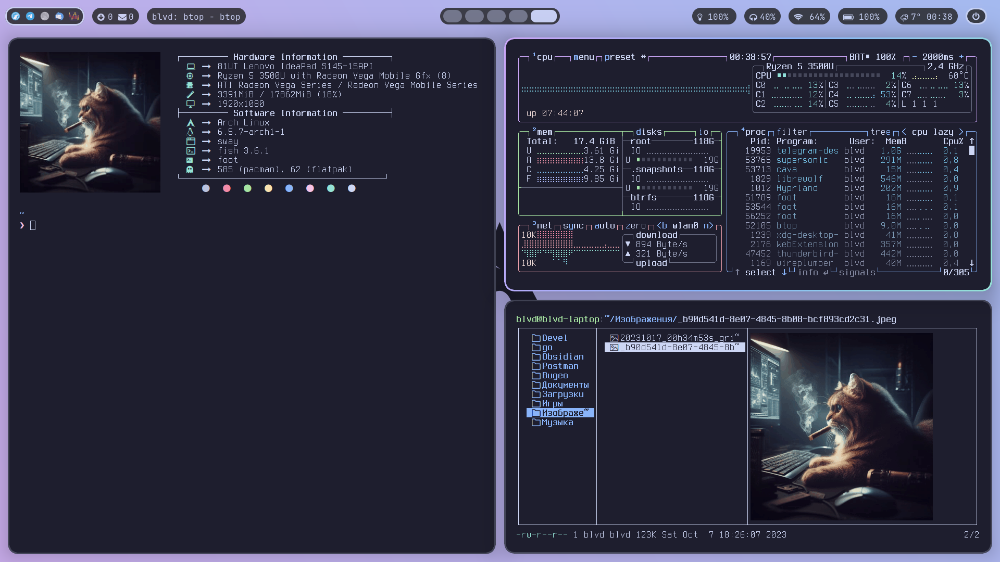
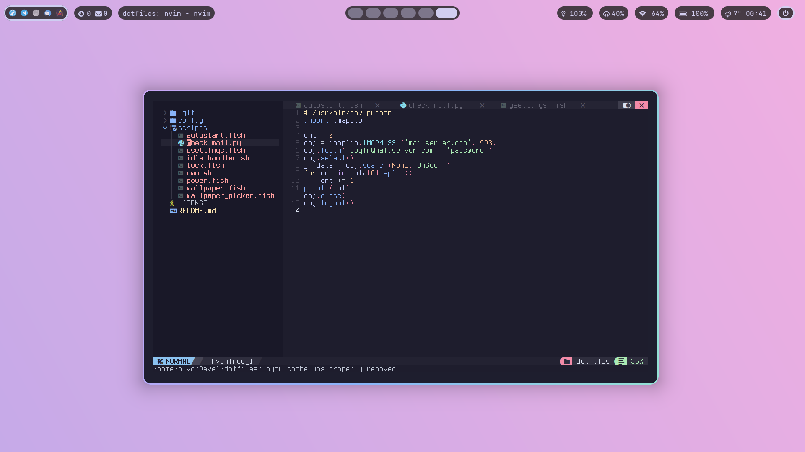

# dotfiles
My dotfiles based on [Catppuccin theme](https://github.com/catppuccin/catppuccin) for hyprland.

## Screeshots

## Theme and functional
[wallpapers](https://github.com/zhichaoh/catppuccin-wallpapers) - wallpapers.\
[Hyprland](https://github.com/hyprwm/Hyprland) - wayland compositor.\
[Waybar](https://github.com/Alexays/Waybar) - bar.\
[swaylcok-effects](https://github.com/mortie/swaylock-effects) - screenlocker.\
[swayidle](https://github.com/swaywm/swayidle) - idle management daemon.\
[wofi](https://hg.sr.ht/~scoopta/wofi) - app launcher.\
[libnotify ](https://gitlab.gnome.org/GNOME/libnotify) - desktop notifications.\
[mako](https://github.com/emersion/mako) - notifications daemon.\
[foot](https://codeberg.org/dnkl/foot) - terminal emulator.\
[fish](https://github.com/fish-shell/fish-shell) - shell.\
[grim](https://git.sr.ht/~emersion/grim) - screenshots.\
[slurp](https://github.com/emersion/slurp) - select region for screenshot.\
[playerctl](https://github.com/altdesktop/playerctl) - mpris controller.\
[light](https://github.com/haikarainen/light) - backlights  manager.\
[swww](https://github.com/Horus645/swww) - wallpaper manager.\
[neofetch](https://github.com/dylanaraps/neofetch) - fetch.

## Fonts and icons
[JetBrains Mono](https://www.jetbrains.com/lp/mono/) - main font.\
[Terminus](https://terminus-font.sourceforge.net/) - terminal font.\
[Papirus Icons](https://github.com/PapirusDevelopmentTeam/papirus-icon-theme) - icons.

## Applications
[mpv](https://github.com/mpv-player/mpv) - video player.\
[imv](https://sr.ht/~exec64/imv/) - image viewer.\
[lf](https://github.com/gokcehan/lf) - file manager.\
[bat](https://github.com/sharkdp/bat) - improved cat command.\
[btop](https://github.com/aristocratos/btop) - a monitor of resources.\
[cava](https://github.com/karlstav/cava) - audio visualizer.\
[NvChad](https://github.com/NvChad/NvChad) - neovim config.\
[sddm](https://github.com/sddm/sddm/) - desktop manager.\
[trash-cli](https://github.com/andreafrancia/trash-cli) - trash manager.\
[libsixel](https://github.com/saitoha/libsixel) - sixel graphics.\
[imagemagick](https://github.com/ImageMagick/ImageMagick) - display images in lf and neofetch.\
[cptv-git](https://github.com/NikitaIvanovV/ctpv) - image preview for lf.\
[chafa](https://github.com/hpjansson/chafa/) - graphics in terminal.\
[atool](https://www.nongnu.org/atool/) - archives managing.\
[jq](https://github.com/jqlang/jq) - command line JSON processor for lf.\
[poppler](https://gitlab.freedesktop.org/poppler/poppler) - pdf rendering for lf.\
[glow](https://github.com/charmbracelet/glow) - render markdown for lf.\
[dragon-drop](https://github.com/schne324/dragon-drop) - drag and drop for lf.\
[fd](https://github.com/sharkdp/fd) - program to find entries in your filesystem.

*The rest of the applications I use through a flatpack.*\
*How you can apply GTK and QT themes to flatpack can be found [here](https://itsfoss.com/flatpak-app-apply-theme/).*

## Useful shortcuts
`SUPER+ENTER` - foot term.\
`SUPER+SHIFT+ENTER` - fullscreen foot term.\
`SUPER+t` - float foot term.\
`SUPER+q` - kill window.\
`SUPER+f` - float windows.\
`SUPER+SHIFT+F` - fullscreen window.\
`SUPER+SPACE` - open wofi menu.\
`SUPER+w` - wallpapers.\
`SUPER+h\j\k\l\arrows` - move focus.\
`SUPER+SHIFT+h\j\k\l\arrows` - move window.\
`SUPER+[1-0]` - move through workspaces.\
`SUPER+CTRL+[1-0]` - move window to workspace.\
`SUPER+g` - group windows.\
`SUPER+TAB` - toggle gorup.\
`SUPER+z` - move trough workspaces.\
`SUPER+x` - move trough workspaces.
